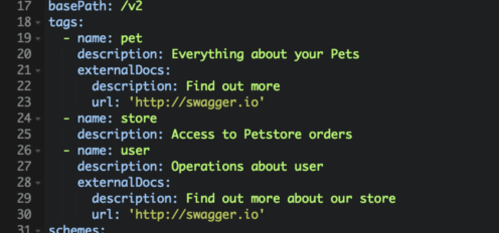
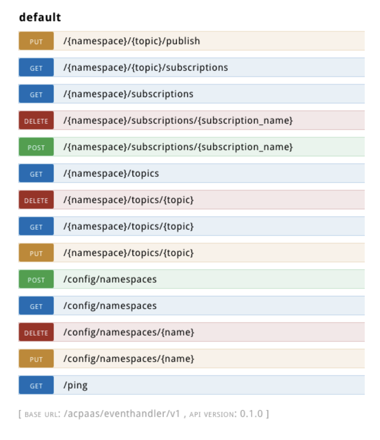
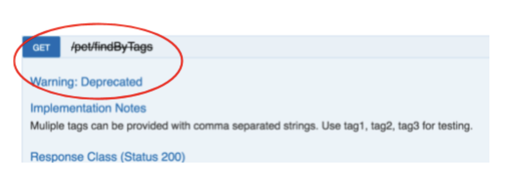
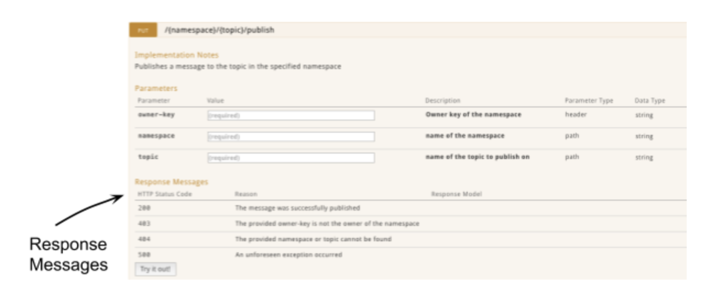

# Goede documentatie in Swagger files

Als je API klaar is, heb je - als alles goed is - een Swagger file. Soms wordt deze gegenereerd, soms met de hand gemaakt. Belangrijk is dat deze Swagger file goed is gedocumenteerd. Een operatie `GET /Assets` met als omschrijving *"Gets the assets"* is vrijwel nutteloos. We merken nochtans, dat veel gegenereerde Swagger files z'n resultaat opleveren. Vandaar, dat we je graag enkele tips geven hoe dit beter kan.  

## Tone of voice ##
Vooraleer we in de specifieke details duiken, willen we het even hebben over uw schrijfstijl, ofwel *"Tone of Voice"*. 

* benader de ontwikkelaars persoonlijk
* beeld je in wat je tegen hen zou zeggen alsof ze naast je zouden zitten
* vind een mooi evenwicht tussen functioneel, beschrijvend en aangenaam om te lezen

## Concepten ##
Als de API wat abstracter is, leg je liefst enkele concepten op voorhand uit. Deze documentatie past niet altijd in de Swagger file (omdat het bv een schema of tekening bevat). Zet deze conceptuele documentie op buiten de Swagger file en leg er een link naar vanuit de Swagger file. 

Merk op dat je Github Flavoured Markdown kan gebruiken in onder andere `description` velden, zo kan je linken naar bijkomende docs leggen.

## Swagger file ##
Momenteel supporteren we [OpenAPI specification 2.0](http://swagger.io/)

In de volgende hoofdstukken gaan we in op de verschillende delen van de Swagger file, meerbepaald:

* [Het Info Object](#Info-object)
* [Werken met Tags](#Werken-met-Tags)
* [De Operations](#De-Operations) 
* Parameters
* Responses

### Info object ###
[zie specificatie hier](https://github.com/OAI/OpenAPI-Specification/blob/master/versions/2.0.md#infoObject)

Het `info` object is de plaats waar je jouw API in de kijker kan zetten. Het is een opportuniteit om de API *te verkopen* als het ware. Wat heb je aan een API dat niemand wil omdat ze er niet van overtuigd zijn. De velden van het Info object zijn:

* title (required)
* version (required)
* description
* contact

Wanneer je een `description` geeft, probeer dan met overtuiging, zinvole informatie te geven. Geef aan:

* waarvoor deze API kan gebruikt worden
* welke andere API's er bijhoren
* leg in een notedop uit wat je ermee kan doen

Geef `contact` informatie op waarmee de ontwikkelaar iets is. De info van een effectieve persoon die kan bereikt worden. Als die persoon dat niet meer doet, kan je dat nog altijd aanpassen of kan die je doorverwijzen. 

In plaats van:

```
    "info": {
        "version": "1.0.0",
        "title": "Form API",
        "description": "Manage forms"
    }

```


kan je beter:

```
    "info": {
        "version": "1.0.0",
        "title": "Form Engine API",
        "description": "With this API you can work with form [templates](https://#) and form [responses](https://#). You need to create form templates (JSON files) upfront by hand or by using the [form composer](https://#). Once created you can store and retrieve these templates using the template API calls. Additionally you can access the form responses from users using API calls described below. [read more](https://#)...",
        "contact": { 
          "name": "Awesome startup", 
          "url": "http://www.awesomestartup.be",
          "email": "jos@awesomestartup.be"
          }
    }
...
```

### Werken met Tags ###

[zie specificatie hier](https://github.com/OAI/OpenAPI-Specification/blob/master/versions/2.0.md#tagObject)

Je kan één of meerdere tags per operation (zie hieronder) toevoegen. Het beste is dat je tags op voorhand definiëert en er omschrijvingen voor voorziet. In het voorbeeld hieronder zie je hoe je dit best kan doen met een  `name` een `description` en een `externalDocs` waarde.



Door gebruik te maken van tags, worden operaties gegroepeerd en geef je er een woordje uitleg bij. Zo gaat het er dan uitzien in Swagger UI:


Stel dat je nu geen tags gebruikt. Wel, dan gaat Swagger UI dit onder een *Default* tag hangen. Dit wordt voor API's met meerdere operaties snel onoverzichtelijk:



Dus, met en : 

1. Definiëer tags op voorhand en geef ze een omschrijving
2. Pas bij elke Operatie een tag toe

### De Operations ###

[zie specificatie hier](https://github.com/OAI/OpenAPI-Specification/blob/master/versions/2.0.md#operation-object)

De belangrijkste zaken in het Operations luik van de Swagger spec voor de documentatie zijn de volgende velden:

* Tags
* Summary
* Description
* Depricated

#### Tags ####
Bij elke operatie kan je een `tag` meegeven zodat ze de operaties in logische groepen verdeeld worden. Zie ook het [inrichten van de tags](#werken-met-tags) hierboven.

#### Summary & description ####
Het `summary` element wordt in Swagger UI getoond op de operatie aan de rechterkant. Je kan het zien wanneer de operatie collapsed is of niet.

Het `description` veld daarentegen zie je enkel wanneer je de details van een operatie opvraagt door het open te klappen. Het komt onder een heading *'implementation notes'*.


Gebruik de `summary` om te beschrijven wat de operatie doet.
Gebruik de `description` om te beschrijven hoe je het kan gebruiken.

#### Depricated ####

Als je een operatie hebt dat je wil uitfaseren, maak je gebruik van de `Depricated` vlag (boolean).



In het voorbeeld hierboven zie je dat Swagger UI een depricated operation gaat doorkruisen en er komt een *'Warning: depricated'* indicatie bij.

### Parameters ###

[zie specificatie hier](https://github.com/OAI/OpenAPI-Specification/blob/master/versions/2.0.md#parameterObject)

Het is steeds aangewezen om een `Description` toe te voegen bij elke parameter. Nog beter is dat je een voorbeeld ervan toevoegd.
 
Hier is een voorbeeld van de Uber API:


### Responses ###

[zie specificatie hier](https://github.com/OAI/OpenAPI-Specification/blob/master/versions/2.0.md#responsesObject)

Bij elke operatie kan je meegeven wat een mogelijke response is. Dit maakt het veel duidelijker voor ontwikkelaars ingeval er iets misloopt. 


